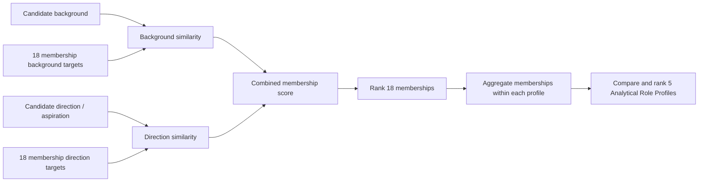
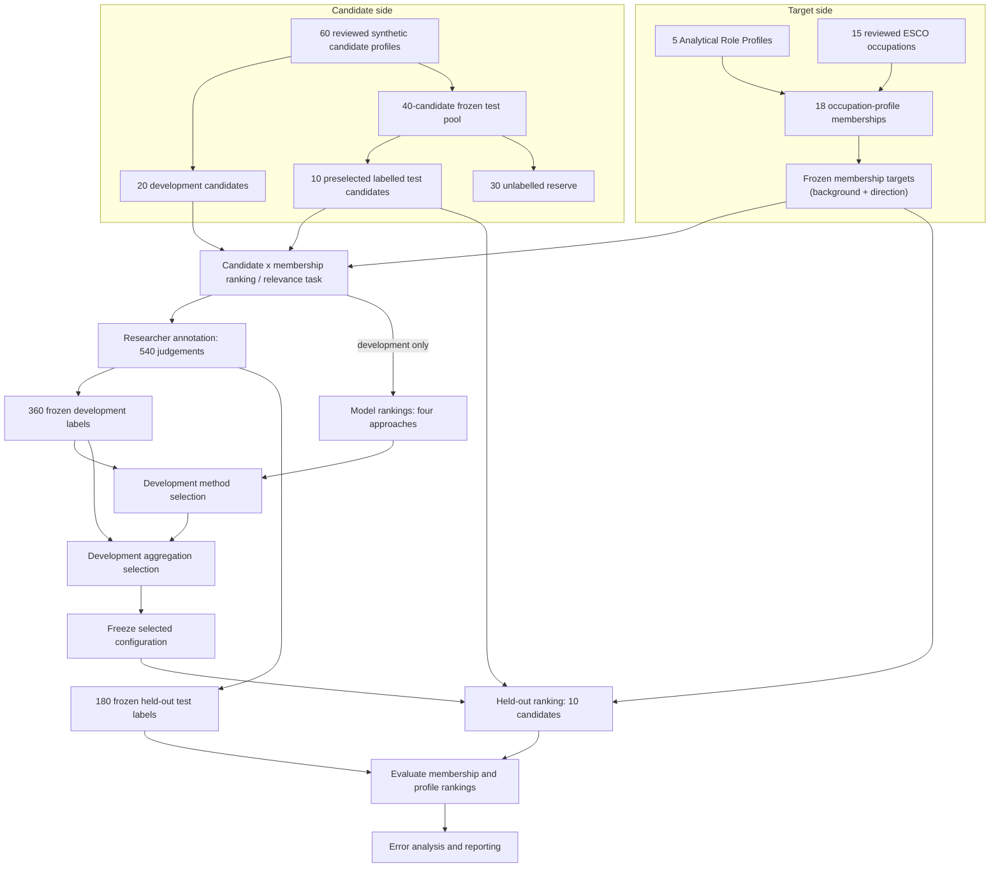

# Career Decision-Support System

An explainable prototype for comparing analytical career directions using a person's experience, skills, and aspirations.

This project connects a **working local application** with a completed ranking study. Its inspectable workflow compares a candidate's background and aspirations with occupational evidence, then ranks five analytical career directions with scores, contributors, and evidence prompts.

**Study at a glance:** four ranking approaches; 60 synthetic candidate profiles; 540 researcher relevance judgements; one final evaluation on 10 held-out candidates. **Selected configuration:** TF-IDF, equal background/direction weights, and `mean_all` profile aggregation.

## The problem and research question

Similar job titles can describe different analytical work. Someone who builds dashboards, investigates business performance, and wants to move into strategy may plausibly align with several directions. Career exploration should compare evidence across those directions rather than simply reproduce a person's previous title or experience.

The completed study asks:

> How closely do evidence-based career-direction rankings agree with researcher relevance judgements in a controlled synthetic-candidate study, and where do they disagree?

## What the system compares

The system presents five **Analytical Role Profiles**: project-defined groupings based on the purpose of the work.

| Career direction | Main focus |
|---|---|
| Strategic Analysis | External change, competition, and longer-term choices |
| Business Performance & Goal Management | Targets, KPIs, performance reviews, and management action |
| Business Strategy & Focused Analysis | Investigating a defined business question and recommending options |
| Data Analytics | Preparing, querying, visualising, and interpreting data |
| Data Science | Statistical modelling, machine learning, and experimentation |

The five profiles connect to **15 reviewed ESCO occupations → 18 occupation–profile memberships**, because an occupation can contribute to several profiles. ESCO is the European classification of Skills, Competences, Qualifications and Occupations; this study uses English v1.2.1. Each membership has reviewed skill evidence and matching targets for its work context and is the fine-grained scoring and annotation unit.

The profiles and mappings are project-defined, not an official ESCO analytical taxonomy. Memberships make each direction's occupational contributors inspectable.

## How a recommendation is produced

The frozen ranker is exposed through a **local bilingual web application**; see [Run the application](#run-the-application).

**Background** combines current role, explicit skills, and experience narrative; **direction** describes desired work. TF-IDF compares these with membership targets: `0.5 × background similarity + 0.5 × direction similarity`. Profile scores average all assigned memberships (`mean_all`).

**Figure 1 — How is one recommendation produced?**



Outputs distinguish **score decomposition**, **membership / aggregation provenance**, and **supplementary skill-evidence prompts**. Rule-based occupational-skill checks support inspection but are **not TF-IDF feature attribution**. Each Top 3 profile shows at most three core-evidence prompts: evidence not found in the input, not an established lack of ability.

## How the study was conducted

The 60 synthetic profiles were AI-drafted and researcher-reviewed: **20 development candidates** and a **40-candidate frozen test pool**. Before model-output inspection, 10 test candidates were preselected for annotation and evaluation; 30 remain an unlabelled reserve.

One annotator assessed all 20 development candidates and the 10 preselected test candidates against all 18 memberships, producing **540 relevance judgements** on a 0–2 scale: **360 development + 180 held-out test labels**. Model outputs and construction metadata were hidden; construction labels never serve as ranking inputs or relevance answers. The same researcher reviewed candidates, defined targets, and supplied labels, so this is not independent external validation.

**Figure 2 — How was the ranking system developed and evaluated?**



### Why TF-IDF was selected

Four approaches were compared using development data only:

| Approach | What it measures | Development membership nDCG@3 |
|---|---|---:|
| Structured | Weighted explicit-skill coverage and direction phrase/token overlap | 0.5872 |
| TF-IDF | Cosine similarity in separate background and direction text spaces | 0.7464 |
| Semantic | Cosine similarity from pinned all-MiniLM-L6-v2 embeddings, without fine-tuning | 0.7533 |
| Hybrid | Weighted combination of Structured and Semantic scores | 0.7181* |

\*Best interior Hybrid setting, with Structured weight 0.25.

**nDCG@3** measures graded relevance agreement across the first three results: higher is better (maximum 1), not an accuracy percentage.

**Semantic had the highest point estimate**, ahead by 0.0069. The recorded, study-specific **practical-tie rule** favours simplicity when the gap is at most 0.01 and the paired interval includes zero. Paired candidate-level bootstrap (2,000 resamples) gave **TF-IDF − Semantic: `[-0.0686, 0.0499]`** (95% interval). Both conditions held, selecting TF-IDF for simpler runtime and inspectable lexical computation—not demonstrating equivalence or TF-IDF superiority.

After method selection, `mean_all` led `max` and `mean_top_2` on development data and was frozen with TF-IDF as **`matching_selected`**. **TF-IDF v0** denotes the preserved initial implementation; the 0.5 / 0.5 weights were fixed, not tuned on test data.

Protocol, comparisons, and bootstrap details: [Research Design](RESEARCH_DESIGN.md#6-experimental-protocol-and-evaluation), [development selection report](reports/matching/DEVELOPMENT_PARAMETER_SELECTION.md), and [technical appendix](docs/RESEARCH_TECHNICAL_APPENDIX.md#c3-uncertainty).

## Results and what they mean

The frozen configuration was evaluated once on the 10 preselected held-out candidates.

| Evaluation level | nDCG@3 | 95% candidate-bootstrap interval | Top-1 agreement |
|---|---:|---|---:|
| 18 occupation–profile memberships — primary | 0.6243 | [0.4198, 0.8128] | 0.60 |
| 5 Role Profiles — secondary | 0.8944 | [0.8141, 0.9593] | 0.80 |

Top-1 agreement counts a result as correct when its human label equals the highest label for that candidate, including ties.

**Profile rankings aligned more closely with reference labels in this sample; membership-level discrimination remained weaker.** These are different tasks, with 5 versus 18 targets and different reference-label construction: profile labels use maximum membership relevance, while model scores use the mean. The higher profile result is not causal evidence that aggregation improves ranking.

Two cases from the [error analysis](docs/ERROR_ANALYSIS.md) illustrate the limits:

- **C019:** a broadly acceptable top profile contained a leading occupation membership labelled irrelevant. Broad profile agreement can hide poor occupational contributors.
- **C056:** aspiration and modelling vocabulary favoured Data Science despite explicitly weak modelling evidence, illustrating lexical matching's difficulty with low-evidence aspirations and negation.

The small synthetic sample and single annotator limit generalisation; label reliability, real-user benefit, demographic fairness, and labour-market validity remain unestablished. Scores indicate comparative relevance, not employment or career-success probabilities. The system is for exploration and must not be used for hiring or candidate screening. Full limitations are in [Research Design](RESEARCH_DESIGN.md#9-discussion-and-limitations).

## Run the application

Use **Python 3.10+**; **Node.js** is also required for experiment validation below. From the project root in PowerShell:

```powershell
python -m venv .venv
.\.venv\Scripts\Activate.ps1
python -m pip install -e ".[dev]"
career-web
```

The browser interface runs on a lightweight Python HTTP service. It supports Chinese and English UI text; English candidate input is recommended. Changing the UI language does not change scores.

The **experimental job-description analyzer** identifies work components in Chinese or English JDs using a separate rule-based method. It has **no labelled evaluation**, and the candidate-ranking evaluation does not validate it. See the [JD method note](docs/JD_PROFILE_ANALYSIS.md).

To check the frozen data and implementation:

```powershell
node experiments/validation/validate_candidate_data.mjs
node experiments/validation/validate_experiment.mjs
python -m pytest
node --test tests/role_profile_experiment.test.mjs
node --test tests/webapp_i18n.test.mjs
```

Optional Semantic and MCP dependencies: `python -m pip install -e ".[semantic,mcp,dev]"`. The [MCP guide](docs/MCP_INTEGRATION.md) describes `career-mcp`. The separate `career-match` command provides generic job-level matching utilities; it is not the frozen five-profile evaluation entry point.

## Repository and reading guide

| Location | Purpose |
|---|---|
| `taxonomy/`, `config/` | Reviewed occupational evidence and versioned method settings |
| `data/` | Synthetic candidates, split records, and human labels |
| `experiments/` | Development comparison, held-out evaluation, and integrity checks |
| `src/`, `webapp/`, `tests/` | Application implementation, interface, and regression tests |
| `reports/`, `results/` | Recorded decisions, audits, frozen results, and score exports |
| `docs/` | Explanations of methods, data, interfaces, and limitations |

**`docs/` explains how and why; `reports/` records what happened in a particular study run.**

| Reading goal | Start here |
|---|---|
| Quick project overview | This README |
| Research design and methodology | [Research Design](RESEARCH_DESIGN.md) |
| Formulas, runtime, and metric details | [Technical appendix](docs/RESEARCH_TECHNICAL_APPENDIX.md) |
| Held-out results | [Evaluation report](reports/evaluation/MATCHING_SELECTED_TEST_EVALUATION.md) |
| Failure cases | [Error analysis](docs/ERROR_ANALYSIS.md) |

The [documentation index](docs/README.md) links to the data card, annotation protocol, repository map, and application materials.

**`matching_selected` is frozen.** Further evaluation, including the 30-candidate reserve, requires a separately versioned protocol; test errors must not be used to retune the completed study.
