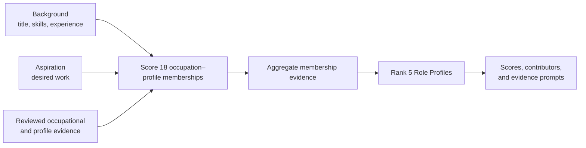

# Career Decision Support System

The **Career Decision Support System** is a research-oriented AI project for human-centred career decision support. It is the implemented research prototype; *Exploring Analytical Career Directions* is the empirical study used to design and evaluate its ranking approach.

**Study at a glance:** 5 project-defined Role Profiles, 15 reviewed ESCO occupations, 18 occupation–Role Profile memberships, 60 synthetic candidates, and 1,080 single-researcher relevance annotations. Four ranking approaches were compared on 20 development candidates; the selected configuration was frozen and evaluated on 40 held-out test candidates.

> **Selected configuration:** TF-IDF + `mean_all` aggregation + equal background/direction weighting.<br>
> **Held-out result:** membership nDCG@3 **0.6606**; Role Profile nDCG@3 **0.8981**. These are ranking metrics, not accuracy percentages.

## 1. Problem and motivation

The project began with an observation from my work in ByteDance's central data recruitment function: different titles could describe similar analytical work, while similar titles could describe substantially different work. Titles alone were therefore an unreliable guide to a person's experience or intended next step.

The design problem is especially visible during career transitions. A ranker driven only by past experience can repeatedly return a person's current field; one driven only by aspiration can overstate an unsupported transition. The study therefore asks:

> How closely do evidence-based career-direction rankings agree with researcher relevance judgements in a controlled synthetic-candidate study, and where do they disagree?

The prototype supports exploration. It does not determine a person's “best” career, predict hiring suitability, or make employment decisions.

## 2. What I designed

I designed a two-level ranking system that keeps **candidate background** and **aspiration** separate, compares both with concrete occupational evidence, and then aggregates detailed matches into five broader analytical directions.



The five **Analytical Role Profiles** are project-defined groupings based on the purpose of the work:

| Career direction | Main focus |
|---|---|
| Strategic Analysis | External change, competition, and longer-term choices |
| Business Performance & Goal Management | Targets, KPIs, performance reviews, and management action |
| Business Strategy & Focused Analysis | A defined business question, option assessment, and recommendations |
| Data Analytics | Data preparation, querying, visualisation, and interpretation |
| Data Science | Statistical modelling, machine learning, and experimentation |

The profiles connect **15 reviewed ESCO occupations** through **18 occupation–Role Profile memberships**; an occupation can contribute to more than one profile. The study uses English ESCO v1.2.1. I defined the five Role Profiles from recurring types of analytical work encountered in recruitment, then manually reviewed the selected occupations and their mappings against those profile boundaries. ESCO supplies the referenced occupations and skills but does not define or validate this grouping.

The interface distinguishes three kinds of evidence:

- **score decomposition** shows the background and direction components;
- **aggregation provenance** shows which memberships contribute to a Role Profile;
- **rule-based skill prompts** provide supplementary evidence checks.

The skill prompts are not TF-IDF feature attribution. A missing prompt means that evidence was not found in the supplied text, not that the person lacks the ability.

## 3. Method and experimental design

The 60 fully synthetic, non-identifying profiles were drafted with AI assistance under controlled coverage of the five Role Profiles and predefined candidate scenarios, then validated, manually reviewed, and frozen. AI assistance was limited to drafting the candidate text; construction metadata such as intended Role Profile and scenario was excluded from ranking inputs.

The data were split with no overlap:

- **20 development candidates** supported method and configuration selection;
- **40 held-out test candidates** were reserved for final evaluation.

Both sets cover all five Role Profiles and multiple candidate scenarios. A single researcher assigned all **1,080 candidate–membership relevance annotations** on a 0–2 scale. Ranking outputs, scores, and construction metadata were hidden during annotation—**model-output-blinded researcher annotation**—but this was not independent, multi-rater, or double-blind validation.

Four method families were compared on development data: **Structured**, **TF-IDF**, **Semantic**, and **Hybrid**. Semantic had the highest development membership nDCG@3 point estimate (0.7533), followed by TF-IDF (0.7464). The paired 95% bootstrap interval for TF-IDF minus Semantic was `[-0.0686, 0.0499]`.

A 0.01 development nDCG@3 difference was used as a **study-specific near-tie heuristic**, alongside uncertainty, reproducibility, interpretability, and implementation simplicity. It is not a universal threshold or a statistical equivalence criterion. TF-IDF was selected as the simpler, inspectable lexical method—not because the study demonstrated equivalence or superiority.

The final ranker computes:

> **membership score = 0.5 × background similarity + 0.5 × direction similarity**

It then averages all memberships assigned to each profile (`mean_all`). This configuration was frozen before held-out evaluation; test results were not used to retune it.

## 4. Core held-out results

The selected configuration was evaluated once on all 40 held-out test candidates.

| Evaluation level | nDCG@3 | 95% candidate-bootstrap interval | Top-1 agreement |
|---|---:|---|---:|
| 18 occupation–Role Profile memberships — primary | **0.6606** | [0.5655, 0.7533] | 0.725 |
| 5 Role Profiles — secondary | **0.8981** | [0.8480, 0.9408] | 0.900 |

nDCG@3 measures graded relevance agreement near the top of a ranking; it is not classification accuracy. Top-1 agreement allows ties and means that rank 1 received the candidate's highest available human label.

Role Profile ordering aligned more closely with the reference labels in this controlled sample, while fine-grained membership ranking remained harder. The two levels are not directly comparable measures of difficulty: they contain 5 versus 18 targets, and their human labels and model aggregation use different constructions.

## 5. Two representative failure cases

### C019 — a plausible direction with an implausible contributor

The leading Role Profile was acceptable, but its top occupation membership—budget analyst—had human relevance 0, while a strong data-analyst membership appeared later. KPI and monitoring language supported the broad performance direction, yet supplied the wrong fine-grained lexical route.

**Why it matters:** a correct broad direction can hide a poor occupational contributor. The interface should present membership provenance and must not describe the strongest occupation as the person's recommended career.

### C056 — aspiration language outweighed weak evidence

Data Science ranked first even though its leading statistician membership had relevance 0 and no membership received label 2. Desired-role and model-operations vocabulary overlapped with modelling targets despite explicit statements that evidence for feature choices, inference, and evaluation design was limited.

**Why it matters:** bag-of-words TF-IDF does not reliably understand negation or evidence absence. A transition aspiration can therefore appear more strongly supported than the supplied background justifies.

These held-out cases informed error analysis only; the frozen configuration was not retuned after test inspection.

## 6. Contributions and limitations

### Contributions

- A two-level formulation connecting inspectable occupational evidence to accessible career directions.
- Separate representation of demonstrated background and stated aspiration.
- A controlled comparison of structured, lexical, semantic, and hybrid ranking approaches.
- Development-only configuration selection followed by frozen held-out evaluation.
- Explanation design that separates ranking-linked evidence from supplementary skill checks.
- Case-level analysis showing where broad profile agreement can conceal fine-grained errors.

### Limitations

- The study uses a small synthetic dataset and one researcher who also contributed to candidate review and target design.
- It provides no inter-rater reliability, external validation, demographic fairness assessment, or real-user outcome evidence.
- ESCO mappings and the five Role Profiles are project design choices, not a validated labour-market taxonomy.
- TF-IDF is sensitive to wording and weak at negation, low-evidence transitions, and mixed directions.
- Results support feasibility under controlled study conditions, not real-world predictive validity or production readiness.

The system is intended for exploratory, human-centred career decision support. It is not designed or validated for automated hiring, recruitment screening, candidate rejection, or autonomous high-stakes employment decisions.

## 7. Read the evidence

| Question | Authoritative source |
|---|---|
| Why was the study designed this way, and what can it claim? | [Research Design and Evaluation](RESEARCH_DESIGN.md) |
| What exactly happened in the held-out evaluation? | [Final Evaluation Report](reports/evaluation/TFIDF_FULL_TEST_EVALUATION.md) |
| How were development methods and parameters compared? | [Development Selection Report](reports/matching/DEVELOPMENT_PARAMETER_SELECTION.md) |
| How were the data generated, governed, and split? | [Data Card](docs/DATA_CARD.md) |
| How were labels assigned and kept separate from model output? | [Experiment Protocol](docs/EXPERIMENT_PROTOCOL.md) and [Annotation Guideline](docs/HUMAN_ANNOTATION_GUIDELINE.md) |
| What are the main risks and intended uses? | [Model Card](docs/MODEL_CARD.md) |
| Which cases failed, and why? | [Error Analysis](docs/ERROR_ANALYSIS.md) |
| What are the formulas and exact runtime details? | [Technical Appendix](docs/RESEARCH_TECHNICAL_APPENDIX.md) |

The [documentation index](docs/README.md) provides additional schemas, data-source policies, and repository guides. Machine-readable results are retained under [`results/`](results/) and run-specific records under [`reports/`](reports/).

## 8. Run the prototype and secondary extensions

### Core local application

Use Python 3.10 or later. From the project root in PowerShell:

```powershell
python -m venv .venv
.\.venv\Scripts\Activate.ps1
python -m pip install -e ".[dev]"
career-web
```

The bilingual browser interface runs on a lightweight local Python service. English candidate input is recommended; changing the interface language does not change ranking scores.

To validate the frozen study records:

```powershell
node experiments/validation/validate_candidate_data.mjs
node experiments/validation/validate_full_study.mjs
python -m pytest
node --test tests/role_profile_experiment.test.mjs
node --test tests/webapp_i18n.test.mjs
```

### Secondary and experimental material

- **MCP interface:** an optional way to expose the same career-ranking capability to compatible clients. Install with `python -m pip install -e ".[mcp]"`, run `career-mcp`, and see the [MCP integration guide](docs/MCP_INTEGRATION.md). MCP is an interface, not part of the ranking experiment.
- **JD Analyzer:** a physically separate, experimental extension under [`experimental/jd_analysis/`](experimental/jd_analysis/). It uses rules to identify work components in Chinese or English job descriptions. It has no labelled evaluation and is outside the core empirical ranking study.
- **Semantic reproduction:** install the pinned optional dependencies with `python -m pip install -e ".[semantic,dev]"`. The frozen semantic comparison used `sentence-transformers` 5.0.0 and `all-MiniLM-L6-v2` without fine-tuning.
- **Generic job matching:** the separate `career-match` command provides job-level matching utilities; it is not the frozen five-profile evaluation entry point.

The selected TF-IDF held-out evaluation is frozen. Historical snapshots remain available through Git tags; held-out errors must not be used for retuning.
