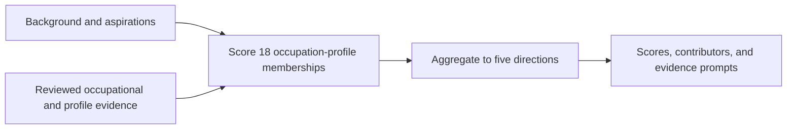

# Exploring Analytical Career Directions: Research Design and Evaluation

**Project:** Explainable Career Decision-Support System  
**Portfolio context:** CUHK-Shenzhen MAIR application — AI direction  
**Document revision:** 2.1, 2026-09-26  
**Completed experiment:** `matching_v2_full_test`, submission-ready revision

This report presents an applied NLP study of career exploration. The revision clarifies its motivation, design, and findings while preserving the completed experiment and distinguishing retrospective interpretation from recorded procedure.

## 1. Problem and motivation

The project grew out of my recruitment work in ByteDance's central data recruitment function. Across five broad types of analytical work, different titles could describe similar responsibilities, while similar titles could describe substantially different work. Titles alone were therefore an unreliable guide to a person's experience or intended next step.

For people entering work or changing careers, transferable experience and intended direction may diverge. They may know the work they want to explore without knowing its occupational name. Ranking mainly from past experience could repeatedly return their existing field, narrowing exploration around what they have already done. This motivates modelling demonstrated background and stated aspiration as separate evidence channels.

I translated this problem into a ranking task: compare candidate evidence with concrete occupational descriptions, then organise the results into broader career directions. The prototype displays separate background and direction scores and evidence prompts to support further investigation. These outputs guide exploration rather than judge readiness or decide which career a person should pursue.

The completed study evaluates alignment with human relevance judgements on synthetic candidate profiles, analyses ranking errors, and checks how explanations relate to computation. Real-user decision usefulness and career outcomes are outside this evaluation.

## 2. Research positioning and questions

### 2.1 Technical positioning

The task is a form of content-based recommendation: candidates and occupational targets are compared through their described attributes rather than through other users' clicks or career histories [1]. TF-IDF provides a lexical retrieval baseline [2], while a pretrained sentence encoder offers a way to compare meaning beyond exact vocabulary overlap [3]. The comparison tests whether that additional representation complexity helps within this scope.

ESCO supplies English-language occupations and associated skills [4]. It provides external reference concepts, but does not determine the project's five analytical directions or validate their mappings. Work on explainable recommendation motivates distinguishing source traceability from an explanation of why a model assigned a numerical score [5].

The project contributes a two-layer formulation of analytical career exploration, a background–aspiration scoring design, and an empirical comparison of four ranking strategies. I defined five Role Profiles and their occupation–profile ranking units, designed graded relevance annotation and membership-to-profile aggregation, and used development selection followed by frozen held-out evaluation. Error analysis examines both ranking levels; explanation inspection separates score evidence from supplementary prompts. The contribution lies in these research and system-design decisions, without a claim to a new model or ranking algorithm. The references provide technical context, not a systematic review.

### 2.2 Research questions

**RQ1 — Method selection.** How do Structured, TF-IDF, Semantic, and Hybrid methods compare on development-set membership ranking, and how does the selected configuration perform on held-out human relevance labels?

**RQ2 — Error patterns.** Where do rankings disagree with human judgements, particularly for mixed directions, transferable experience, or little direct evidence?

**RQ3 — Output traceability.** Which displayed outputs can be traced directly to score computation or aggregation, and what are the limits of supplementary skill-evidence prompts?

RQ1 is addressed by the ranking experiment, RQ2 by descriptive test-case analysis, and RQ3 by implementation inspection and existing regression checks.

## 3. Task formulation: directions, occupations, and evidence

### 3.1 Why these five directions?

The five Analytical Role Profiles reflect types of work I frequently encountered in recruitment. They bound the initial problem to a domain I could interpret and review. They are project-defined constructs, not ByteDance's official job architecture or an independently validated labour-market taxonomy.

| Role Profile | Main distinction |
|---|---|
| Strategic Analysis | Long-horizon change, strategic alternatives, and resource-allocation decisions |
| Business Performance & Goal Management | Recurring targets, KPIs, variance diagnosis, and management action |
| Business Strategy & Focused Analysis | A defined commercial or business question, option assessment, and recommendations |
| Data Analytics | Data preparation, querying, reporting, visualisation, and interpretation |
| Data Science | Statistical or machine-learning modelling, experimentation, and prediction |

The distinction is work purpose, not title or seniority: a multi-year assessment of technological change belongs toward Strategic Analysis, while a product-profitability investigation belongs toward Business Strategy & Focused Analysis. Both may use market data but support different decisions.

### 3.2 Why use two layers?

Role Profiles and occupations answer different questions. A Role Profile asks, “What kind of analytical work do I want to explore?” An ESCO occupation supplies concrete work descriptions and skills for evidence comparison. The two-layer structure connects accessible directions with specific source material, avoiding reliance on variable occupation titles while retaining detail for evidence and preparation prompts.

Fifteen reviewed ESCO occupations are linked to the five profiles through 18 occupation–profile memberships. A membership means one occupation viewed within one profile's work purpose. The mapping is many-to-many because a single occupation can contribute to more than one direction. The matcher scores each membership separately, then aggregates its scores into the five profiles.

This structure exposes cases where a plausible broad direction has an implausible leading occupational contributor. Its mapping and aggregation choices also affect results; Section 9 discusses the limits of architectural inference.

### 3.3 Why ESCO and fifteen occupations?

I chose ESCO because it was an English-language occupational system I knew that linked descriptions to skills, which suited the evidence-comparison task. Fifteen is the size of the retained, reviewed occupation set associated with the five profiles, not an empirically optimal catalogue size. The source snapshot and mapping decisions are retained in the [taxonomy records](taxonomy/README.md).

The study uses English ESCO v1.2.1. Reviewed core and supporting skills are retained; optional ESCO relations and excluded evidence do not enter matching. Project-specific additions are recorded separately from ESCO sources.

### 3.4 Inputs and outputs

Scoring uses four candidate fields: current job title, explicit skills, experience narrative, and desired work directions. The implemented field names are `current_job_title`, `skills`, `experience_narrative`, and `desired_work_directions`. Background combines the first three; direction uses the fourth. Years of experience is descriptive context and does not affect the score. Construction metadata, scenario categories, and intended sampling profiles are excluded.

Each candidate receives 18 membership scores and five aggregated profile scores. These are comparative relevance signals, not probabilities of career fit or employment. The primary evaluation unit is candidate × membership; the secondary unit is candidate × Role Profile.

A local web application and MCP interface expose the selected ranker. The separate experimental job-description analyser is outside this candidate-ranking study; see [its own scope and method](docs/JD_PROFILE_ANALYSIS.md).

## 4. Data and researcher annotation

### 4.1 Construction, coverage, and provenance

The dataset contains 60 synthetic, non-identifying profiles. I used AI assistance to draft the profiles and reviewed them myself. Each profile sampling stratum contains 12 candidates. Scenario coverage comprises Direct Match (15), Adjacent Transfer (13), Career Transition (12), Weak / Low Evidence (10), and Ambiguous Case (10). These are coverage choices, not estimates of real-world prevalence.

Twenty candidates form the development set, balanced at four per profile and four per scenario. Forty form the frozen test set. All forty were annotated against the same 18 memberships and enter the final v2 evaluation. The original ten-candidate result remains recoverable at Git tag `v1.0-selected-test-10`; it is not a parallel current result.

Review covered plausibility, schema consistency, identifying information, duplicates, split separation, and copying or leakage from occupational targets. AI-assisted construction may still introduce repeated vocabulary or stylistic regularities.

The [data-source policy](docs/DATA_SOURCE_POLICY.md) records five de-identified real-person seed profiles as controlled synthesis references, excluded from the released synthetic ranking inputs.

### 4.2 Relevance labels and researcher roles

I designed the 0/1/2 relevance scheme and, as sole researcher and annotator, assigned 1,080 judgements: 20 development candidates × 18 memberships and 40 test candidates × 18 memberships. No independent second annotator participated, so inter-annotator reliability cannot be estimated.

| Label | Meaning |
|---:|---|
| 0 | Insufficient relevant evidence or a substantive mismatch |
| 1 | Partial, adjacent, or transferable evidence; background or direction alignment is incomplete |
| 2 | Clear supporting experience or skills, with a compatible stated direction |

Aspiration alone is insufficient for label 2. Annotation considers the combined occupation–profile target and does not mechanically average background and direction.

The annotation view hid model outputs and construction metadata, although my prior knowledge of candidate construction and taxonomy remained. The labels are researcher judgements made with a restricted view, rather than independent external validation.

The distribution is 614 zeros, 279 ones, and 187 twos. Quality checks found complete membership blocks, no duplicate pairs, and no invalid or missing relevance labels. These establish completeness, not judgement reliability. See the [data card](docs/DATA_CARD.md) and [annotation guideline](docs/HUMAN_ANNOTATION_GUIDELINE.md).

## 5. Methods and design rationale

### 5.1 Background and aspiration as separate channels

Every method combines its two components as:

**Membership score = 0.5 × background score + 0.5 × direction score.**

Equal weighting implements the exploration motivation in Section 1: aspirations receive the same numerical weight as background, with separate components available for inspection. Alternative weights were not evaluated. A high direction score can compensate for weak background, whereas label 2 requires substantive support—a tension in low-evidence cases. Equal coefficients also need not produce equal practical influence when component distributions differ.

### 5.2 Four ranking approaches

| Method | Computation | Purpose of comparison |
|---|---|---|
| Structured | Weighted explicit-skill coverage; token and phrase recall for direction | Test transparent, constrained matching |
| TF-IDF | Separate background and direction vectors; cosine similarity | Test lexical evidence without an embedding model |
| Semantic | Separate text embeddings from a fixed pretrained encoder; cosine similarity | Test representation beyond exact vocabulary overlap |
| Hybrid | Weighted combination of Structured and Semantic scores | Test whether their signals complement one another |

Structured assigns core skills weight 1 and supporting skills weight 0.5. Its background score uses explicitly listed skills, not the experience narrative. It is a deliberately constrained baseline: differences from the other methods reflect evidence use as well as representation, not model architecture alone.

TF-IDF fits its vocabulary and inverse document frequencies on 18 frozen target texts in each channel. Candidate texts are transformed in those spaces without fitting on the candidate pool. Unseen terms supply no matching signal, and the bag-of-words representation cannot reliably interpret negation.

Semantic uses the pinned all-MiniLM-L6-v2 model without fine-tuning. Raw cosine similarity is mapped from −1–1 to 0–1. Hybrid combines Structured and Semantic scores with Structured weights of 0, 0.25, 0.5, 0.75, and 1; the endpoints reproduce Semantic and Structured. Their common range does not calibrate distributions, so weight 0.5 need not give equal ranking influence. Scale compatibility remains an untested explanation of results.

The [technical appendix](docs/RESEARCH_TECHNICAL_APPENDIX.md) retains equations, text construction, runtime versions, tie handling, and exact-input repeatability checks.

### 5.3 Aggregation and two-stage selection

Three rules convert membership scores into a profile score: highest score (`max`), mean of the highest two (`mean_top_2`), and mean of all assigned memberships (`mean_all`). The selected mean_all rule reduces dependence on one high-scoring occupation, but can dilute strong alignment with a particular occupation inside a broader profile.

The procedure first selected a method using development membership nDCG@3, then compared aggregation rules for TF-IDF; it was not a joint method–aggregation search. Retrospectively, this sequence keeps fine-grained matching visible before compression into broad directions, where plausible ordering can conceal poor contributors. This interpretation is distinct from the documented original procedure.

For secondary evaluation, a profile's human label is the maximum among its memberships: whether the direction contains at least one strongly relevant target. Model averaging measures distributed support instead. This difference matters when interpreting profile results.

## 6. Experimental protocol and evaluation

All method and aggregation selection uses the twenty development candidates. Candidate content, occupational evidence, labels, and configuration were frozen before evaluating on all forty held-out candidates. Test results were not used to revise `matching_v2`. The [protocol](docs/EXPERIMENT_PROTOCOL.md) and [selected TF-IDF configuration](config/selected/tfidf.json) preserve the procedure and provenance.

The primary metric is membership nDCG@3, calculated per candidate and then averaged. It rewards placing higher relevance labels near the top, with gains of 0, 1, and 3 for labels 0, 1, and 2. It is a ranking-quality measure, not a percentage of correct recommendations. The five-profile ranking is evaluated separately.

| Supporting measure | Interpretation |
|---|---|
| nDCG@5 | Ranking quality over the top five |
| Top-1 agreement | Rank 1 has the candidate's maximum human label, allowing ties |
| MRR for label 2 | How early the first Strong Match appears; eligibility is reported explicitly |
| Pairwise ordering agreement | Agreement on ordering item pairs with unequal human labels |
| Coverage@k | Fraction of targets appearing in at least one candidate's Top-k; breadth, not accuracy |

Uncertainty uses 2,000 candidate-level percentile bootstrap resamples, keeping each candidate's 18 dependent judgements together. Method comparisons evaluate both methods on the same paired resamples.

The recorded practical-tie rule prefers the simpler method when the membership nDCG@3 gap is at most 0.01 and the paired difference interval contains zero. It combines ranking performance with runtime/dependency complexity and inspectability using a study-specific tolerance, not an equivalence test. The selection and freeze records document its use, without establishing when the threshold was first formulated.

## 7. Results

### 7.1 Development method selection

| Method | nDCG@3 | nDCG@5 | Top-1 | MRR, label-2 eligible | Coverage@3 |
|---|---:|---:|---:|---:|---:|
| Semantic | 0.7533 | 0.7123 | 0.700 | 0.8177 | 0.944 |
| TF-IDF | 0.7464 | 0.7291 | 0.700 | 0.8385 | 0.944 |
| Hybrid α=0.25 | 0.7181 | 0.7141 | 0.750 | 0.8375 | 0.889 |
| Hybrid α=0.50 | 0.6506 | 0.6495 | 0.600 | 0.7073 | 0.889 |
| Hybrid α=0.75 | 0.6267 | 0.6297 | 0.500 | 0.6417 | 0.833 |
| Structured | 0.5872 | 0.6198 | 0.500 | 0.6177 | 0.889 |

Semantic led the primary point estimate. TF-IDF was lower by 0.006901; the paired 95% interval for TF-IDF minus Semantic was [−0.068648, 0.049863]. Both practical-tie conditions were met, so TF-IDF was selected for its lower runtime/dependency complexity and inspectable lexical computation. This supports a bounded engineering choice, not TF-IDF superiority.

### 7.2 Development aggregation selection

| TF-IDF aggregation | Profile nDCG@3 | Profile nDCG@5 | Profile Top-1 |
|---|---:|---:|---:|
| mean_all | 0.8850 | 0.9531 | 0.900 |
| max | 0.8721 | 0.9402 | 0.850 |
| mean_top_2 | 0.8712 | 0.9396 | 0.850 |

Mean_all led these point estimates and was selected. The table does not establish a statistically reliable aggregation advantage. The final configuration is TF-IDF, equal background/direction weights, and mean_all; see the [development report](reports/matching/DEVELOPMENT_PARAMETER_SELECTION.md).

### 7.3 Held-out evaluation

The configuration was evaluated on all forty held-out candidates with 720 membership labels. Thirty-four candidates had at least one label-2 membership; none had all-zero labels.

| Metric | Membership result (95% interval) | Role Profile result (95% interval) |
|---|---|---|
| nDCG@3 | 0.6606 [0.5655, 0.7533] | 0.8981 [0.8480, 0.9408] |
| nDCG@5 | 0.6782 [0.5930, 0.7610] | 0.9507 [0.9214, 0.9742] |
| Top-1 agreement | 0.7250 [0.5750, 0.8500] | 0.9000 [0.8000, 0.9750] |
| MRR, label-2 eligible | 0.8110 [0.7000, 0.9108] | 0.9510 [0.8922, 1.0000] |
| Pairwise ordering agreement | 0.7814 [0.7317, 0.8269] | 0.8534 [0.7994, 0.9018] |
| Coverage@3 | 0.9444 | 1.0000 |

Membership Coverage@5 was 1.0000. The [test report](reports/evaluation/MATCHING_V2_FULL_TEST_EVALUATION.md) contains the complete results and candidate identifiers.

Profile ordering aligned more closely with reference labels on these measures, but target counts and label construction differ between levels. The nDCG difference therefore does not isolate a causal benefit of aggregation.

## 8. Error analysis and explanation checks

### 8.1 What the failures reveal

The completed [error analysis](docs/ERROR_ANALYSIS.md) examines frozen results descriptively. The explanations below are plausible interpretations, not experimentally isolated causes.

| Case | Observation | Research implication |
|---|---|---|
| C019 | A broadly acceptable first profile contained a leading budget-analyst membership labelled 0, while a strong data-analyst membership appeared later. | Broad ordering can conceal an implausible occupational contributor; both levels matter. |
| C024 | Business Performance ranked first despite stronger human-labelled memberships in adjacent strategy directions. | Recurring performance vocabulary can dominate mixed evidence; a single ordering may hide alternatives. |
| C056 | Data Science ranked first, its leading statistician membership had label 0, and no membership received label 2. | Aspiration and model-related vocabulary can outweigh explicit evidence limitations; lexical similarity cannot reliably interpret negation. |

C010 similarly illustrates competition between recurring performance language and longer-horizon strategic evidence. These cases motivate investigation of evidence sufficiency, mixed directions, and representation choices; they support no scenario-level population estimates.

### 8.2 Three kinds of explanation

| Output type | Connection to computation | Limit |
|---|---|---|
| Score decomposition | Background and direction components combine under the recorded weights. | Does not establish readiness or a calibrated probability. |
| Aggregation provenance | Membership identifiers show which scores contributed to the profile mean. | Does not make the highest-scoring occupation the person's best career. |
| Supplementary evidence prompts | Explicit skill matches and possible missing core evidence come from reviewed skills and rule-based checks. | Does not fully explain the TF-IDF score or diagnose every capability gap. |

The third category uses shared occupational sources but is computed separately from TF-IDF similarity. Term-level score attribution would require contributing vector terms and values, which the application does not provide.

Existing regression checks cover output structure, contributor membership, Top-3-only missing-evidence display, a maximum of three core prompts per profile, and suppression for recognised narrative phrases or configured aliases. The implementation recognises explicit forms; it does not reliably resolve arbitrary paraphrases or negation. A prompt means that the configured checks did not find explicit evidence, not that the person lacks the skill.

Core status and provenance support inspection; learning priorities, prerequisites, costs, and successful transitions were not evaluated.

## 9. Discussion and limitations

The findings connect representation choices to task definition: the practical-tie rule supported the simpler lexical method, while error analysis exposed its difficulty with negation and low-evidence aspirations. Broad profile agreement can also coexist with poor occupational contributors, making both evaluation levels necessary for interpreting this prototype.

The two-layer design makes the researcher-defined mapping part of model behaviour. Shared occupations reuse source material across targets; membership counts affect averaging and maximum-label opportunities. No direct-profile baseline was evaluated, and the aggregation comparison establishes only a point-estimate preference. The study therefore does not show that two layers outperform direct profile scoring.

- **Construct validity:** the score measures a chosen balance of background and aspiration, not readiness, transition feasibility, or career benefit.
- **Researcher dependence:** I reviewed AI-generated candidates, defined the targets, and produced the labels. Construction knowledge and shared assumptions can influence evaluation despite hidden annotation fields. Model–label disagreement may reflect model error, my judgement, or ambiguous boundaries.
- **Statistical scope:** twenty development and forty labelled test candidates support exploratory comparison. Bootstrap intervals neither overcome the limited synthetic sample nor quantify annotator uncertainty or establish population performance.
- **Reproducibility versus robustness:** deterministic sorting and fixed versions support repeated computation; systematic paraphrase, noise, and cross-language robustness were not evaluated. The selected matcher uses English evidence.
- **External and user validity:** the five directions and fifteen occupations are narrow, with judgement-dependent boundaries requiring independent review. No study of real job seekers, explanation comprehension, Chinese labour-market validity, demographic fairness, user agency, or learning outcomes was conducted.

The prototype is for career exploration and must not be used for hiring, screening, promotion, or automated eligibility decisions. Excluding protected attributes does not by itself establish fairness. Preserving user choice is a design intention whose practical effect remains to be tested.

## 10. Contribution and next research steps

The study connects my problem formulation, target and annotation design, and evaluation decisions to an implemented prototype. Its outcomes are a reproducible comparison, analysis of membership- and profile-level failures, and a distinction between score explanation, aggregation provenance, and supplementary evidence prompts. Candidate drafting used AI assistance; I reviewed the profiles and supplied the labels. This account does not claim unaided authorship of every implementation component. Four extensions follow:

1. **Test the task formulation.** In a new development study, compare direct-profile scoring with membership aggregation and examine background-only, direction-only, and combined scores. Predefine how evidence sufficiency and aspiration should interact before evaluating new held-out data.
2. **Strengthen independent evaluation.** Obtain independently produced labels and review the profile boundaries. Evaluate paraphrases and negation with controlled cases, keeping these distinct from real-user effectiveness.
3. **Evaluate explanation and preparation use.** Separate score evidence from skill prompts in a user study. Test whether users distinguish aspiration from demonstrated readiness and identify a reasonable next information-gathering or learning step.
4. **Validate the experimental JD path separately.** Build and blind-label a representative licensed or fully synthetic JD corpus, freeze development and test splits, and compare the current deterministic evidence-group baseline with JD-specific lexical, semantic, and hybrid methods. Candidate-side test results must not be reused as JD validation evidence.

Extensions require a separate study version and preserve `matching_v2_full_test` unchanged.

## References

1. Pazzani, M. J., and Billsus, D. (2007). Content-Based Recommendation Systems. In *The Adaptive Web*. [Publisher record](https://doi.org/10.1007/978-3-540-72079-9_10).
2. Manning, C. D., Raghavan, P., and Schütze, H. (2008). *Introduction to Information Retrieval*. Cambridge University Press. [Author-hosted text](https://nlp.stanford.edu/IR-book/).
3. Reimers, N., and Gurevych, I. (2019). Sentence-BERT: Sentence Embeddings using Siamese BERT-Networks. *EMNLP-IJCNLP*. [ACL Anthology](https://aclanthology.org/D19-1410/). This supplies sentence-embedding context; the exact model is specified in the appendix.
4. European Commission. *European Skills, Competences, Qualifications and Occupations (ESCO)*. [Official portal](https://esco.ec.europa.eu/en). The experiment uses the recorded English v1.2.1 snapshot.
5. Zhang, Y., and Chen, X. (2020). Explainable Recommendation: A Survey and New Perspectives. *Foundations and Trends in Information Retrieval*, 14(1), 1–101. [Publisher record](https://doi.org/10.1561/1500000066).

## Supporting records

- [Technical appendix: equations, runtime, and evaluation definitions](docs/RESEARCH_TECHNICAL_APPENDIX.md)
- [Candidate freeze](reports/freezes/CANDIDATE_DATASET_FREEZE.md), [membership evidence freeze](reports/freezes/MEMBERSHIP_SKILL_EVIDENCE_FREEZE.md), and [annotation freeze](reports/freezes/HUMAN_ANNOTATION_FREEZE.md)
- [Selected configuration freeze](reports/freezes/MATCHING_V2_FREEZE.md) and [machine-readable evaluation](reports/evaluation/matching_v2_full_test_evaluation.json)
- [Documentation guide](docs/README.md)
